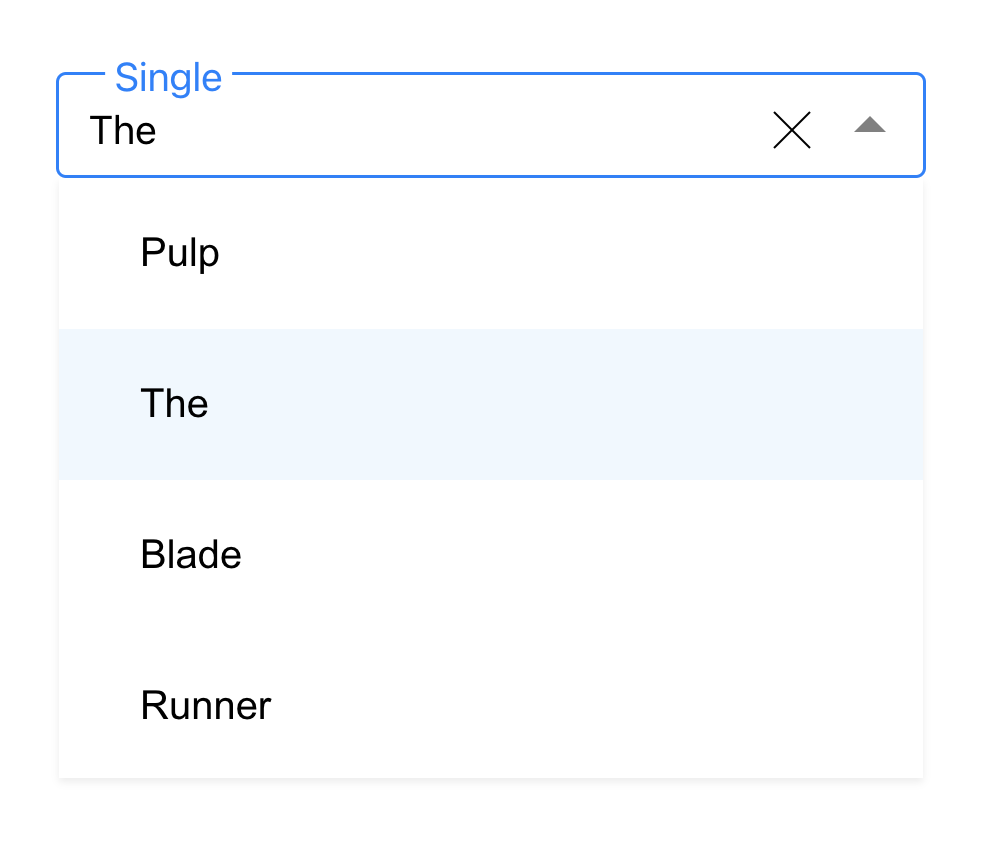
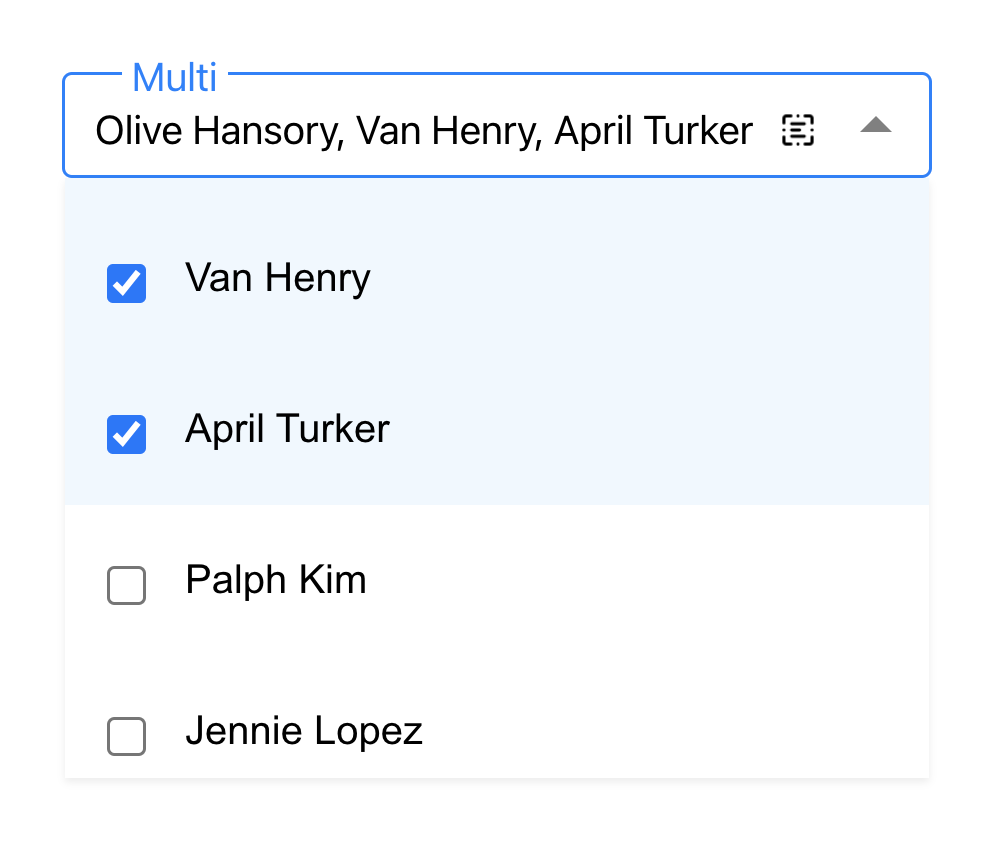

# Instruction

## Dropdown

### Single


* Support single selection
* Support clear selection
* Selected content will be shown when dropdown is closed
* Dropdown will be shown as scroll bar is items are too much


### Multiple



* Support multiple selection
* Support select all selections and unselect all selections
* Selected content will be shown when dropdown is closed
* Selected content can will be shown as scroll bar is text is too long
* Dropdown will be shown as scroll bar is items are too much

## Usage
```
<Dropdown title='Single' items={items} />
<Dropdown title='Multi' items={items} multiSelect />
```

* **Title** is dropdown title
* **Items** is array of items with object ``` {
    id: 1,
    value: 'Olive Hansory',
  } ```
* **multiSelect** shows is multiselect or not

Sample codes are in `App.js`

## Run

In the project directory, you can run:

### `npm install`

Then
### `npm start`

Open [http://localhost:3000](http://localhost:3000) to view it in your browser.

